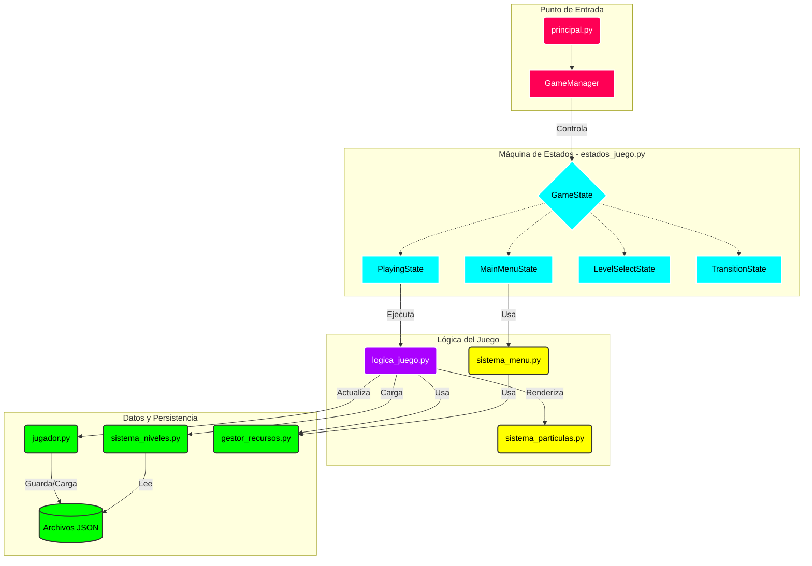

# Arquitectura del Juego NeonFit

Este documento describe la arquitectura de software utilizada en el proyecto NeonFit. El juego utiliza una **Arquitectura basada en Estados** con una clara separación entre lógica, datos e interfaz.

## Paradigmas de Programación Utilizados

El proyecto combina varios paradigmas para lograr un código robusto y mantenible:

### 1. Programación Orientada a Objetos (POO)

Es el paradigma principal del proyecto. Se utiliza para modelar las entidades del juego y sus interacciones.

- **Encapsulamiento:** Clases como `Player`, `Game` y `Menu` encapsulan su propio estado y comportamiento.
- **Herencia:** Se utiliza en el sistema de estados, donde `MainMenuState`, `PlayingState`, etc., heredan de la clase base `GameState`.
- **Polimorfismo:** El `GameManager` trata a todos los estados de manera uniforme a través de la interfaz `GameState`, llamando a sus métodos `update()` y `draw()` sin conocer la implementación específica.

### 2. Programación Imperativa

Se utiliza dentro de los métodos para definir la secuencia paso a paso de las operaciones.

- El bucle principal del juego (`while running:`) es un ejemplo clásico de control de flujo imperativo.
- La lógica de actualización de partículas y movimiento del jugador sigue instrucciones secuenciales directas.

### 3. Programación Dirigida por Eventos

El juego reacciona a las acciones del usuario y eventos del sistema.

- El bucle principal captura eventos de `pygame.event.get()` (teclado, ratón, cierre de ventana).
- Estos eventos se propagan a través del estado activo (`current_state.handle_input(event)`), permitiendo que cada pantalla responda de manera diferente a la misma entrada (ej. la tecla ESC pausa el juego o vuelve atrás en el menú).

## Diagrama de Arquitectura

## Explicación de los Módulos

### 1. Núcleo (Rojo - `principal.py`)

- **GameManager:** Es el "cerebro" central. No contiene la lógica del juego, sino que administra el bucle principal y delega el control al "Estado" activo (Menú, Juego, etc.).

### 2. Máquina de Estados (Cyan - `estados_juego.py`)

- El juego implementa el **Patrón State**.
- Cada pantalla es una clase independiente (`MainMenuState`, `PlayingState`, etc.) que hereda de `GameState`.
- Esto permite aislar la lógica de entrada y renderizado de cada sección del juego.

### 3. Lógica del Juego (Morado - `logica_juego.py`)

- **Game:** Contiene la lógica central del puzzle: transformaciones geométricas (incluyendo soporte para rueda del mouse), detección de colisiones, gestión de movimientos globales y condiciones de victoria.
- **Sistema de Partículas (`sistema_particulas.py`):** Maneja los efectos visuales de forma independiente.
- **Sistema de Menú (`sistema_menu.py`):** Maneja la lógica visual y de navegación de los menús.

### 4. Datos y Persistencia (Verde)

- **Sistema de Niveles (`sistema_niveles.py`):** Carga la configuración de los niveles desde archivos `.json` externos, permitiendo modificar el diseño sin tocar código.
- **Jugador (`jugador.py`):** Gestiona la persistencia de datos (guardado/carga de progreso, puntuaciones y reserva global de movimientos). Implementa la lógica de reinicio de progreso (Roguelike) al agotar recursos.
- **Gestor de Recursos (`gestor_recursos.py`):** Centraliza la carga de assets (fuentes, imágenes) para optimizar el rendimiento.

### 5. Mecánicas de Juego y Economía

El juego ha evolucionado hacia un sistema de gestión de recursos tipo Arcade/Roguelike:

- **Movimientos Globales:** A diferencia de los límites por nivel tradicionales, el jugador posee una reserva global de movimientos (`INITIAL_GLOBAL_MOVES`).
- **Consumo y Recompensa:**
  - Cada acción consume 1 movimiento de la reserva global.
  - Al completar un nivel, se recuperan los movimientos gastados y se otorga una bonificación basada en la dificultad (`MOVES_REWARD`).
- **Condición de Derrota Global:** Si la reserva de movimientos llega a 0, se reinicia todo el progreso del jugador (niveles desbloqueados y puntuaciones), regresando al estado inicial.

## Flujo de Datos Típico

1.  El `GameManager` inicia en `MainMenuState`.
2.  El usuario selecciona un nivel, cambiando el estado a `PlayingState`.
3.  `PlayingState` instancia la clase `Game`.
4.  `Game` solicita a `sistema_niveles.py` la carga del archivo JSON correspondiente (ej. `level_1.json`).
5.  Al completar el nivel, `Game` actualiza el progreso en `jugador.py`, que guarda los datos en disco.
